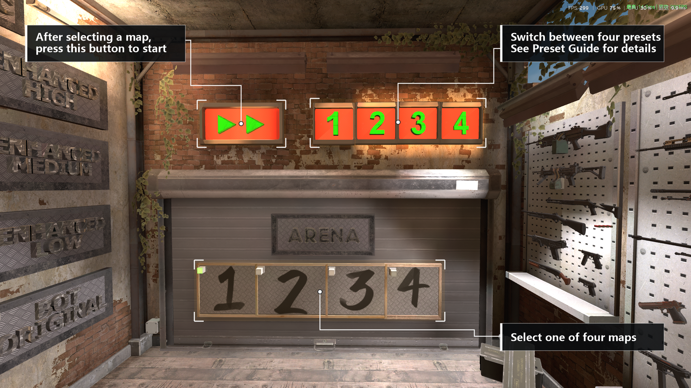
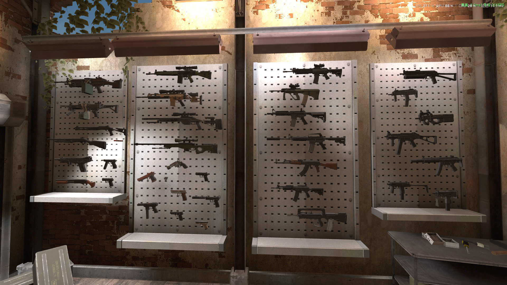
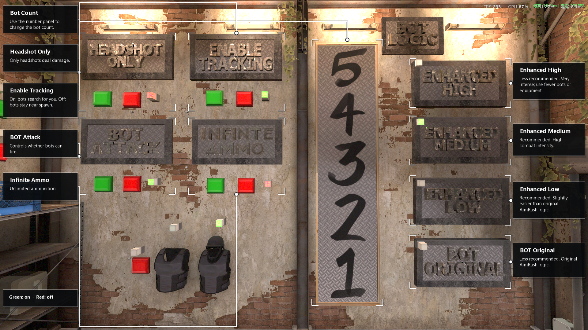
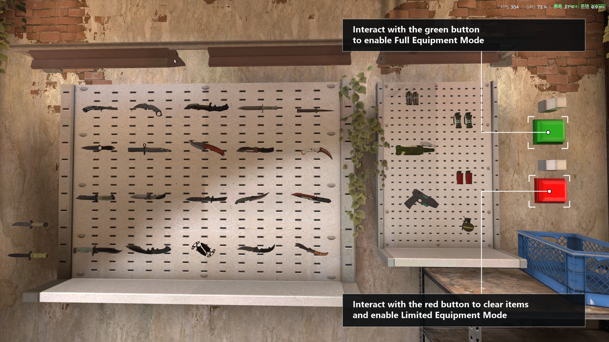
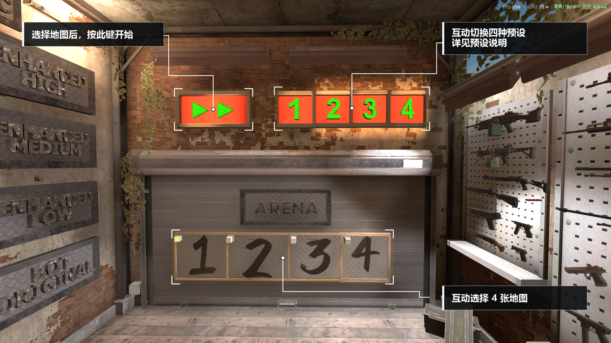
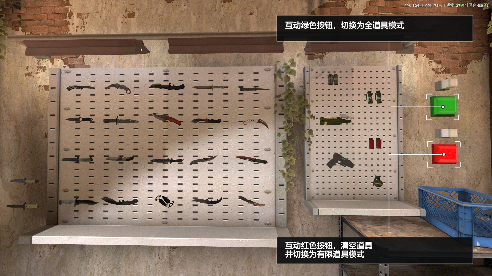

# Aim Rush - Community Modified Version

> A community-modified version of the classic CS2 warm-up and aim training map **Aim Rush**, originally created by **JoeyyBiden**.

---

## Table of Contents / 目录

### English

- [Project Overview](#en-overview)
- [How to Use](#en-usage)
- [Version Information](#en-version)
- [Usage Instructions](#en-instructions)
- [Preset Configurations](#en-presets)
- [Bot Logic](#en-bots)
- [Enhanced Bot Utility Reactions](#en-utility-reactions)
- [Credits](#en-credits)

### 中文

- [项目概览](#zh-overview)
- [使用方法](#zh-usage)
- [版本提示](#zh-version)
- [使用说明](#zh-instructions)
- [预设配置](#zh-presets)
- [Bot 逻辑说明](#zh-bots)
- [Enhanced Bot 对道具的反应](#zh-utility-reactions)
- [致谢](#zh-credits)

---

# English

<a id="en-overview"></a>

## Project Overview

This project is a CS2 Workshop map modified from the classic **Aim Rush** map created by **JoeyyBiden**.

---

<a id="en-usage"></a>

## How to Use

Search for the following map in the CS2 Steam Workshop:

**Aim Rush - Community Modified Version**

Subscribe to the map and launch CS2. The map will then be available in your Workshop maps.

- **Steam Workshop Page:**  
  https://steamcommunity.com/sharedfiles/filedetails/?id=3779660631

- **Workshop ID:**  
  `3779660631`

---

<a id="en-version"></a>

## Version Information

When the map is loaded, the current version number will be displayed in the in-game text panel.

If the displayed version is lower than **v2.2.0**, or no version number is shown, please update the map to ensure the best experience.

### How to Force a Workshop Update

Steam Workshop may not always update the map automatically.

If the map has not been updated:

1. Unsubscribe from the map.
2. Subscribe to it again.
3. If CS2 starts downloading Workshop files, the map update has been triggered.
4. Enter the map again and check the displayed version number.

---

<a id="en-instructions"></a>

## Usage Instructions

### Basic Controls

- All interactive objects can be activated using the **Use / Interact key**.
- Most interactive objects can also be triggered by **dealing damage to them**.



### Weapons & Settings





> The images above show the currently available weapons and Bot-related settings.

### Knives & Utilities



> The image above shows all currently available knife and utility replacements.

---

<a id="en-presets"></a>

## Preset Configurations

Preset configurations **do not include map/room selection or knife selection**.

The map includes four default presets:

| Preset | Weapon / Mode | Reload | Bots | Spawn Peek |
| --- | --- | --- | ---: | --- |
| Config 1 | Deagle Pistol Mode | Required | 3 | Off |
| Config 2 | AK-47 | Required | 4 | Off |
| Config 3 | AK-47 | Required | 3 | On |
| Config 4 | AWP | Not Required | 4 | On |

### Saving Custom Presets

After adjusting your current settings, use one of the following console commands to save the current configuration to the corresponding preset slot:

```text
aimrush_save_config 1
aimrush_save_config 2
aimrush_save_config 3
aimrush_save_config 4
```

For example:

```text
aimrush_save_config 2
```

This saves the current configuration to **Config 2**.

---

<a id="en-bots"></a>

## Bot Logic

The **Target Tracking** setting only affects the three **Enhanced Bot** modes.

The map currently provides **Bot Original** and **three Enhanced Bot modes**.

### Bot Original

**Bot Original** uses the original Aim Rush Bot logic and directly uses the highest-difficulty Bots available in CS2.

Due to some navigation issues introduced during the map decompilation process, Original Bots may occasionally show unusual movement behavior in certain areas.

For example:

- Unusual movement paths
- Unnatural movement behavior
- Navigation issues in certain areas

### Enhanced Bot

The map currently provides **three Enhanced Bot modes**.

All three Enhanced Bot modes use external scripts.

Current shared settings:

- **Reaction time:** `0.35s`
- **Target awareness:** Full-map awareness by default
- **Core behavior logic:** The same across all three modes
- **Main differences:** Attack-related parameters

Therefore, all three Enhanced Bot modes use the same core behavior logic, with different attack parameters used to create different difficulty levels.

---

<a id="en-utility-reactions"></a>

## Enhanced Bot Utility Reactions

| Utility | Bot Behavior |
| --- | --- |
| **Flashbang** | Bots lose their current attack target. After the flash effect ends and the target is reacquired, they may continue firing short bursts in the direction they are currently facing. |
| **Molotov / Incendiary Grenade** | Bots detect nearby fire and perform limited avoidance behavior. However, shooting and other attack actions have higher priority than avoiding fire. |
| **Smoke Grenade** | Bots treat smoke as cover / visual obstruction. |
| **HE Grenade** | No special reaction is currently implemented. |

---

<a id="en-credits"></a>

## Credits

Special thanks to **JoeyyBiden** for creating **Aim Rush**, an excellent warm-up and aim training map.

The Bot logic modifications in this version were heavily inspired by the open-source project **CS2-Bot-Improver**. Special thanks to its developer and contributors.

- **CS2-Bot-Improver:**  
  https://github.com/ed0ard/CS2-Bot-Improver

---

# 中文

<a id="zh-overview"></a>

## 项目概览

本项目是基于 **JoeyyBiden** 制作的经典地图 **Aim Rush** 修改而来的 CS2 创意工坊地图。

---

<a id="zh-usage"></a>

## 使用方法

在 CS2 创意工坊搜索：

**Aim Rush - Community Modified Version**

订阅地图并启动国际服 CS2，即可在创意工坊地图中使用。

- **Steam 创意工坊页面：**  
  https://steamcommunity.com/sharedfiles/filedetails/?id=3779660631

- **创意工坊 ID：**  
  `3779660631`

---

<a id="zh-version"></a>

## 版本提示

打开地图时，游戏内的文本提示区域会显示当前版本号。

如果显示的版本低于 **v2.2.0**，或没有出现版本提示，请更新地图以获得最佳体验。

### 强制更新地图的方法

Steam 创意工坊有时不会自动更新地图。

如果地图没有更新：

1. 取消订阅本地图。
2. 重新订阅。
3. 如果此时 CS2 触发创意工坊文件下载，则说明地图更新已经触发。
4. 再次进入地图并检查版本号。

---

<a id="zh-instructions"></a>

## 使用说明

### 基本操作

- 所有可互动物品均可以通过 **交互键** 使用。
- 大部分可互动物品也可以通过 **造成伤害** 来触发。



### 枪械与设置


> 上图为当前版本全部可用枪械及 Bot 相关设置。

### 匕首与道具



> 上图为当前版本全部可替换的匕首和道具。

---

<a id="zh-presets"></a>

## 预设配置

预设配置**不包括地图区域和匕首的选择**。

地图默认自带 4 种预设：

| 预设 | 武器 / 模式 | 换弹 | Bot 数量 | Spawn Peek |
| --- | --- | --- | ---: | --- |
| 配置 1 | Deagle 手枪模式 | 需换弹 | 3 | 关 |
| 配置 2 | AK-47 | 需换弹 | 4 | 关 |
| 配置 3 | AK-47 | 需换弹 | 3 | 开 |
| 配置 4 | AWP | 无需换弹 | 4 | 开 |

### 保存自定义预设

调整好当前配置后，可以使用以下控制台命令，将当前配置保存到对应预设槽位：

```text
aimrush_save_config 1
aimrush_save_config 2
aimrush_save_config 3
aimrush_save_config 4
```

例如：

```text
aimrush_save_config 2
```

会将当前配置保存为 **配置 2**。

---

<a id="zh-bots"></a>

## Bot 逻辑说明

**是否追踪**只影响 3 种 **Enhanced Bot**。

目前地图提供 **Bot Original** 和 **3 种 Enhanced Bot**。

### Bot Original

**Bot Original** 使用原版 Aim Rush 的 Bot 逻辑，直接使用游戏内部最高难度 Bot。

由于地图反编译过程中出现了一些导航问题，目前 Original Bot 在部分区域可能存在一些异常运动行为。

例如：

- 移动路线异常
- 运动行为不自然
- 个别区域出现导航问题

### Enhanced Bot

地图目前提供 **3 种 Enhanced Bot 模式**。

3 种 Enhanced Bot 均使用外部脚本。

当前统一设定：

- **反应时间：** `0.35s`
- **目标感知：** 默认全图透视
- **主要行为逻辑：** 三种模式相同
- **主要区别：** 攻击相关参数不同

因此，三种 Enhanced Bot 本质上使用相同的行为逻辑，仅通过调整不同的攻击参数来形成不同难度。

---

<a id="zh-utility-reactions"></a>

## Enhanced Bot 对道具的反应

| 道具 | Bot 行为 |
| --- | --- |
| **闪光弹** | Bot 会丢失当前攻击目标。闪光效果结束并重新找到目标后，可能会继续向当前正对方向进行点射。 |
| **燃烧瓶 / 燃烧弹** | Bot 会检测附近火焰，并执行一定程度的躲避行为。但开枪等攻击行为的优先级高于躲避。 |
| **烟雾弹** | Bot 会将烟雾视为掩体 / 视野遮挡。 |
| **HE 手雷** | 目前没有特殊反应。 |

---

<a id="zh-credits"></a>

## 致谢

感谢 **JoeyyBiden** 创作了 **Aim Rush**，这是一张非常优秀的热身与练枪地图。

本修改版的 Bot 逻辑修改大量参考了开源项目 **CS2-Bot-Improver**，在此特别感谢该项目的开发者与贡献者。

- **CS2-Bot-Improver：**  
  https://github.com/ed0ard/CS2-Bot-Improver
